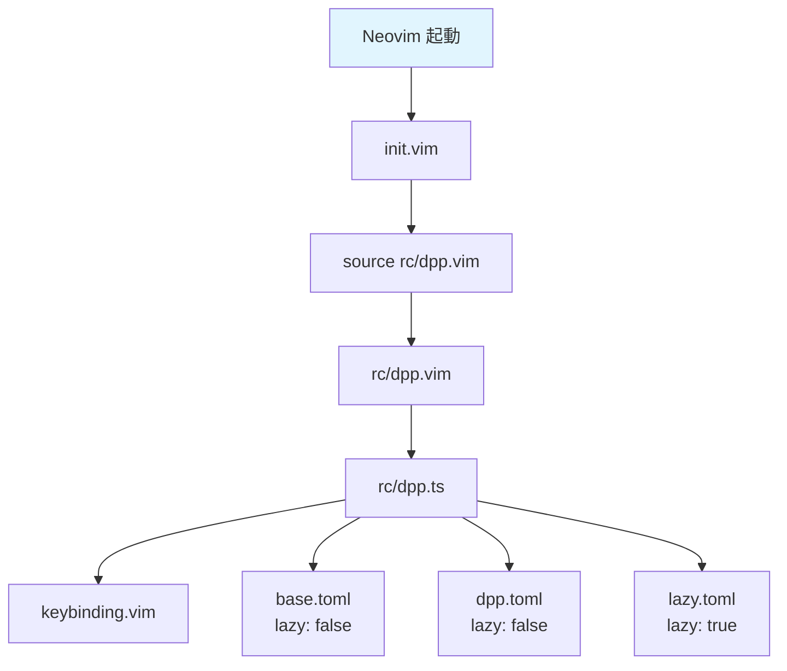

## 心機一転
いまの設定もごちゃついてきたのでまた1から作りなおす

## コンセプト
**全ての設定意図を把握する**

- コピペ設定を許すな
- 呼び出している処理の意味を理解した上で設定する
- 分からない設定は調べてコメントに残す

## Evaluation Order



## chore

### practival usage of a localleader

基本概念：
- leader（スペース）: グローバルなキーマッピング用
- localleader（,）: ファイルタイプ固有のキーマッピング用

```vim
" 実用例：

" Markdown ファイル:
autocmd FileType markdown nnoremap <localleader>p :MarkdownPreview<CR>
autocmd FileType markdown nnoremap <localleader>b :!pandoc % -o %:r.pdf<CR>
autocmd FileType markdown nnoremap <localleader>t :TableFormat<CR>

" Python ファイル:
autocmd FileType python nnoremap <localleader>r :!python %<CR>
autocmd FileType python nnoremap <localleader>d :!python -m pdb %<CR>
autocmd FileType python nnoremap <localleader>f :!black %<CR>

" LaTeX ファイル:
autocmd FileType tex nnoremap <localleader>c :!pdflatex %<CR>
autocmd FileType tex nnoremap <localleader>v :!open %:r.pdf<CR>
autocmd FileType tex nnoremap <localleader>w :VimtexCountWords<CR>

" JavaScript/TypeScript:
autocmd FileType javascript,typescript nnoremap <localleader>r :!node %<CR>
autocmd FileType javascript,typescript nnoremap <localleader>l :!eslint %<CR>
autocmd FileType javascript,typescript nnoremap <localleader>t :!npm test<CR>
```

